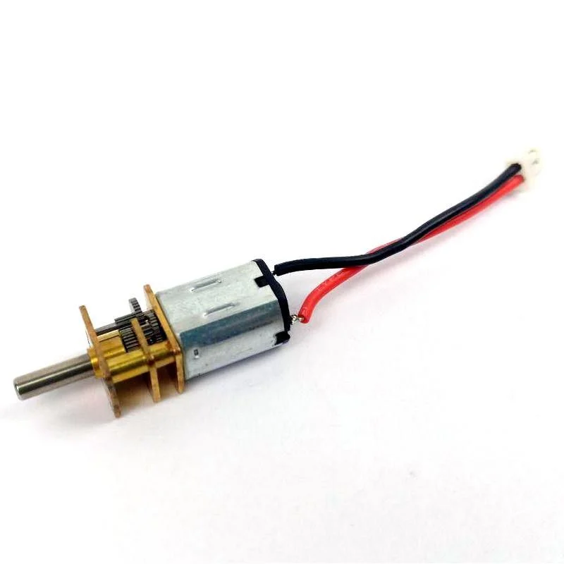
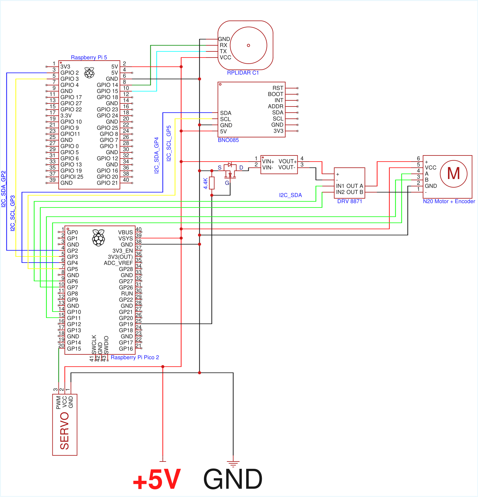

# Hello! We are **Team KMIDS-GFM**.

# WRO - Future Engineers - Robotics Project Documentation

## Team Members

- **Chayanon Ninyawee (Garfield)**
- **Supakorn Sunthonthammarat (Pleum)**
- **Thammatouch Chantasarn (Kao)**

We are a team of dedicated students with a passion for robotics and innovation. This repository documents our full engineering process, including design, components used, development, testing, and coding of our robot.

## Table of Contents

<!-- toc -->

- [1. About the Project](#1-about-the-project)
- [2. Mobility Management](#2-mobility-management)
  - [2.1 Drive System](#21-drive-system)
  - [2.2 Steering](#22-steering)
- [3. Power and Sense Management](#3-power-and-sense-management)
  - [3.1 Power Source](#31-power-source)
  - [3.2 Sensor and Camera](#32-sensor-and-camera)
  - [3.3 Processing Units](#33-processing-units)
  - [3.4 Circuit Diagram](#34-circuit-diagram)
- [4. Obstacle Management](#4-obstacle-management)
  - [4.1 Open Challenge](#41-open-challenge)
  - [4.2 Obstacle Challenge](#42-obstacle-challenge)
  - [4.3 Parallel Parking](#43-parallel-parking)
  - [4.4 Source Code Summary](#44-source-code-summary)

<!-- tocstop -->

______________________________________________________________________

## 1. About the Project

This project focuses on designing, building, and programming an autonomous robot capable of completing a series of complex obstacle challenges as part of the WRO Future Engineers competition.

Team KMIDS-GFM was inspired by the challenge of applying engineering principles and problem-solving skills to creatively and efficiently solve complex problems. Pushing forward with our passion for innovation and hands-on learning.

Our goal is to design and build a reliable and efficient system that demonstrates our technical and collaborative skills while serving as a learning experience. We followed a systematic process, including brainstorming, researching, prototyping, testing, and iterating. We maintained detailed documentation for ease of knowledge sharing and a smoother workflow throughout the project.

Our robot is engineered using a custom modular chassis in a rear-wheel drive configuration, controlled using a Raspberry Pi 5 and a Raspberry Pi Pico 2. It utilizes a combination of an LIDAR sensor and a fish-eye lens camera to provide an advanced system for obstacle detection and navigation.

Our objective is to create an intelligent robot that is capable of navigating through obstacles with pinpoint precision and speed.

______________________________________________________________________

## 2. Mobility Management

- **Drive System:** 2-wheel differential drive (rear wheels).
- **Steering:** Front-wheel steering using S0004m servo.

### 2.1 Drive System

**Motor: N20 Motor** <!--FIXME: Add link to buy the motor here -->

<table>
  <tr>
    <td align="center" width="300" >
      
    </td>
    <td>
      <h3>Specifications:</h3>
      <ul>
        <li>Voltage: 6V </li>
        <li>No-load Speed: 500RPM </li>
        <li>Stall Torque 0.15kg-cm</li>
        <li>Current: 0.023A</li>
        <li>Gear Ratio: 1:30</li>
      </ul>
    </td>
  </tr>
</table>

**Reason for Selection:**

- It is compact and lightweight, allowing us to fit it into our robot easily.
- Provides moderate torque that is more than enough for the flat arena.
- Easy to use on the robot and integrate with other parts.

The N20 motor is equipped with an encoder to provide precise motion feedback, ensuring the robot’s movements are accurate. The motor drives the rear wheels through a LEGO differential gear system, which allows the robot to maintain smooth and balanced turns even at higher speeds. By distributing torque between the two wheels, the differential minimizes wheel slip and ensures stability during sharp maneuver.
The integration of encoders with the N20 motors provides real-time feedback for closed-loop control, enabling precise speed regulation and consistent lap performance. Although the torque of the N20 is modest, the combination with the differential gear makes it well-suited for the flat and predictable competition arena, striking a balance between efficiency, stability, and mechanical simplicity.

**Mounting:**

- Installed using 3D-printed motor clamps screwed to a detachable motor plate that is placed above the differential gear compartment. This will allow for future changes to accommodate bigger motors and gears. <!--FIXME: Add link to the STL file-->
- Wires connected to Raspberry Pi Pico 2.
- Rubber wheels are screwed onto the motor shaft.

**Considerations:**
To reach a faster speed, we can upgrade the N20 motor to the N30, which is the easiest upgrade, providing an overall improvement in speed and torque. However, the N30 motor is typically larger and such, might need extra modifications to the robot's chassis and motor clamp to fit properly. It also generally operates at higher voltages and currents, so the power supply needs to be modified to support this upgrade.

### 2.2 Steering

We considered many steering systems, but following our design principle of precision, we decided to implement Ackermann steering geometry to better replicate the precise turning behavior of real-world vehicles. Unlike simpler systems, Ackermann steering has the advantage of smoother turns by moving each wheel at different angles in a turn, reducing the slippage of the tires and improving turn accuracy.

The fundamental principle of Ackermann geometry involves positioning the steering linkage so that a line drawn through both front wheels intersects the rear axle of the robot.


While this steering geometry is complex to implement, we believe that the advantages it provides are important, especially in obstacle navigation and parking, where precise control and minimized turning radius are essential. It enables smoother maneuver and accurate alignment in narrower spaces.

Our implementation involves designing a custom 3D-printed Ackermann steering mechanism. Using CAD to design the mechanism gives us the flexibility to experiment with pivot points and steering angles. Although true Ackermann geometry is difficult to implement at our robot's scale, we tried to approximate the behavior iteratively by adjusting the servo horns and angles in CAD and prototyping by making smaller changes if it doesn't suit our desired behavior.

**Calibration and Implementation**

To make sure the steering angle performed correctly, we carried out an iterative calibration process:

- We manually adjusted the servo horn angle and linkage positions step by step in FreeCAD until the wheels aligned at the desired steering angle.
- After each adjustment, we observed whether the wheels tracked correctly in both directions.
- Once the optimal angle is reached, we make sure to model the steering mechanism around the angle.


**Servo: S0004m** <!--FIXME: Add link to buy the servo here -->

<table>
  <tr>
    <td align="center" width="300" >
      
    </td>
    <td> 
      <h3>Specifications:</h3>
      <ul>
          <li>Rated Torque: 0.6kgf-cm</li>
          <li>Speed: 0.09sec/60°</li>
          <li>Voltage: 5V</li>
          <li>Gearing: Plastic</li>
          <li>Type: Digital </li>
      </ul>
    </td>
  </tr>
</table>

**Reason for Selection:**

- The small size and PWM interface make it easy to control via Raspberry Pi Pico 2.
- It has sufficient torque to steer the front wheels responsively.
- It has balanced speed and stability during turns and lane changes.
- This servo is widely used in hobby robotics, and as such, there is much available documentation and mounting kits.

**Mounting:**

- Screwed directly into a platform plate in front of the chassis into the platform plate.
   <!--FIXME: Add servo_screw.png-->
   <!--FIXME: Add servo_mounting.png-->

**Considerations**
While the servo used is adequate for the task, it can still be replaced with something more precise. We plan to upgrade to a high-resolution digital servo with a narrower deadband and metal gears for more accurate movement. By also integrating a PWM driver such as the PCA9685, we gain 12-bit resolution control, which gives the robot the ability to make finer adjustments than the Raspberry Pi’s native PWM.

______________________________________________________________________

## 3. Power and Sense Management

### 3.1 Power Source

[18650 Lithium-Ion Battery](https://th.cytron.io/p-3.7v-2000mah-li-ion-battery)

<table>
  <tr>
    <td align="center" width="300" >
      
    </td>
    <td>
      <h3>Specifications:</h3>
      <ul>
          <li>Capacity: 2000 mAh</li>
          <li>Normal voltage: 3.7V</li>
          <li>Standard discharge: 10A </li>
          <li>Weight: 48g</li>
      </ul>
    </td>
  </tr>
</table>

The power and sensor systems are crucial to the vehicle's ability to navigate the challenges of the competition. For this project, the vehicle is powered by a [EP-0136 Raspberry Pi UPS](https://wiki.52pi.com/index.php?title=EP-0136) (Uninterruptible Power Supply) in our vehicle, with 2x 18650 Lithium-Ion as the energy source. The UPS maintains a stable 5V output to the Raspberry Pi 5 even though there are fluctuations. It also has built-in charging and voltage regulation circuits, allowing continuous operation while also recharging the batteries when external power is connected.
The batteries are connected in series to provide a nominal voltage of 7.4V and a combined capacity of around 4000 mAh, depending on the cells used. This setup is capable of delivering a continuous current of around 20 Amps, which is sufficient to supply to the robot for various tasks. This setup ensures that the Raspberry Pi won't shut down unexpectedly, allowing uninterrupted data processing and decision-making throughout the run.

The motors, however, require a higher voltage — at least 6V, and to ensure reliable performance, the N20 motor power is supplied through a step-up converter that increases 5V to 12V. Because the motor power is separate from the Raspberry Pi, the standard on/off switch could not fully control the system. To solve this, a MOSFET and a 4.4 kΩ resistor were added between the gate and source, with the drain connected to the negative side of the step-up converter. This allows the robot to be safely powered on and off while supplying sufficient power to both the Raspberry Pi and the motors.

The onboard processing unit, the Raspberry Pi 5, serves as the vehicle's brain. Raspberry Pi recommends a 5V 5A power supply. This is well within the limits of what the two batteries can provide.

 <!--FIXME: Add battery_location.png-->

### 3.2 Sensor and Camera

[RPLIDAR C1](https://www.slamtec.com/en/C1)

<table>
  <tr>
    <td align="center" width="300" >
      
    </td>
    <td>
      <h3>Specifications:</h3>
      <ul>
        <li>Distance Range:
          <ul>
            <li>White: 0.05~12m (70% Reflectivity)</li>
            <li>Black: 0.05~6m (10% Reflectivity)</li>
          </ul>
        </li>
        <li>Angle Resolution: 0.72°</li>
        <li>Sample Frequency: 8~12Hz (10Hz Typical)</li>
        <li>Range Accuracy: 15mm</li>
        <li>Discharge Rate: 30C</li>
        <br/><br/>
      </ul>
    </td>
  </tr>
</table>

**Reason for Selection:**

- **Precise distance measurement** of obstacles within a wide radius
- **360° scanning** makes it ideal for SLAM (Simultaneous Localization and Mapping).
- **Compact size and lightweightness** allow easy fitting on our robot.
- **Fast sampling rate** allows real-time mapping and obstacle avoidance.

The LIDAR's sensor driver has been custom-coded to better fit our needs. [Code Link Here]

 <!--FIXME: Add LIDAR_mount.png-->

[Fish Eye Lens Raspberry Pi 5MP IR Camera](https://th.cytron.io/p-fish-eye-lense-raspberry-pi-5mp-ir-camera?r=1&language=en-gb&gad_campaignid=18809653822)

<table >
  <tr>
    <td align="center" width="300" >
      
    </td>
    <td >
      <h3>Specifications:</h3>
      <ul>
        <li>Voltage: 6V</li>
        <li>Resolution: 5MP </li>
        <li>Focal Length: Adjustable</li>
        <li>Image Sensor: OV5647</li>
        <li>Aperture: F2.35</li>
      </ul>
    </td>
  </tr>
</table>

**Reason for Selection:**

- **130° wide field of view** captures a large area for tracking.
- **Infrared compatibility** enables low-light vision.
- **High-resolution (5MP)** provides a clear image for the robot.
- **Compact size** fits well on our robot.

This setup allows for a wide-angle view, enhancing environmental awareness during both the Open Challenge and Obstacle Challenge. The camera identifies course elements such as walls, pillars, colored markers, parking spaces, and lane lines.

- Detect and differentiate wall positions.

- Identify pillar colors and types.

- Recognize parking zones.

- Track path lines and boundaries.

### 3.3 Processing Units

[Single Board Computer: Raspberry Pi 5](https://gammaco.com/gammaco/Raspberry_Pi_GB_89RD014.html)

<table>
  <tr>
    <td align="center" width="300" >
      
    </td>
    <td>
      <h3>Specifications:</h3>
      <ul>
        <li>Quad-core Arm Cortex-A76 CPU @ 2.4GHz</li>
        <li>8GB LPDDR4X RAM</li>
        <li>Dual 4K HDMI output (60fps)</li>
        <li>PCIe 2.0 support via FPC connector</li>
        <li>2x USB 3.0 ports, 2x USB 2.0 ports</li>
      </ul>
    </td>
  </tr>
</table>

[Raspberry Pi Pico 2](https://th.cytron.io/p-raspberry-pi-pico2-board)

<table>
  <tr>
    <td align="center" width="300" >
      
    </td>
    <td>
      <h3>Specifications:</h3>
      <ul>
        <li>Dual ARM Cortex-M33</li>
        <li>4 MB QSPI flash memory</li>
        <li>520KB SRAM</li>
        <li>2.4GHz 802.11n wireless LAN</li>
        <li>26 multi-function GPIO pins</li>
      </ul>
    </td>
  </tr>
</table>

### 3.4 Circuit Diagram

**Wiring Diagram:**



______________________________________________________________________

## 4. Obstacle Management

The open challenge involves the robot completing three full laps around the field without touching the wall. The size of each side of the field and the direction in which the car drives are randomized.

The obstacle challenge requires the robot to complete three laps whilst avoiding the traffic signs. If the sign is red, then the robot must traverse on the right side and if the pillar is green, the robot must traverse on the left. The direction in which the car drives and the placement of the signs are randomized. After the third lap, the car must find the parking area and park in the area without touching the surroundings barriers around it.

Our implementation relies heavily on the RPLIDAR C1 sensor and the fish-eye lens camera for continuous environment scanning, which helps the algorithm decide the movement of the robot.

We divide the strategy into three phases:

- Open Challenge
- Obstacle Challenge
- Parallel Parking Maneuver

### 4.1 Open Challenge

\
*Figure: Example of robot sensing walls and navigating the field.*

The Open Challenge requires the robot to complete three laps around the arena without touching the walls. The driving direction is randomized at the start, so relying on pre-programmed movements is not feasible

The robot determines which direction to turn by analyzing the walls detected around it. The algorithm works as follows:

1. **Check for empty walls:**

   - If there are no front walls or no side walls, the function returns `std::nullopt` because it cannot determine a turn direction.

1. **Identify the closest front wall:**

   - Compares all front wall line segments and selects the one with the highest midpoint (largest Y value).
   - Determines left and right points of this front wall based on their X coordinates.

1. **Evaluate left walls:**

   - Finds the "higher" point of each left wall line segment.
   - Uses `perpendicularDirection` and `perpendicularDistance` to determine if a left turn is feasible.
   - Returns `COUNTER_CLOCKWISE` if a left turn is clear, or `CLOCKWISE` if blocked.

1. **Evaluate right walls:**

   - Similarly checks right wall line segments.
   - Returns `CLOCKWISE` if a right turn is clear, or `COUNTER_CLOCKWISE` if blocked.

1. **Fallback:**

   - If no rules match, returns `std::nullopt`, indicating that the turn direction cannot be determined.

<details>
<summary>Click here to show C++ code</summary>

```cpp
/**
 * @brief Determine the robot's turn direction based on relative walls.
 *
 * @param walls Resolved or candidate walls around the robot.
 * @return Optional RotationDirection; empty if turn direction can't be determined.
 */
std::optional<RotationDirection> getTurnDirection(const RelativeWalls &walls) {
    if (walls.frontWalls.empty()) return std::nullopt;
    if (walls.leftWalls.empty() && walls.rightWalls.empty()) return std::nullopt;

    // Pick the highest front line
    const LineSegment *frontLine = &walls.frontWalls[0];
    float frontMidY = (frontLine->y1 + frontLine->y2) / 2.0f;
    for (const auto &line : walls.frontWalls) {
        float midY = (line.y1 + line.y2) / 2.0f;
        if (midY > frontMidY) {
            frontLine = &line;
            frontMidY = midY;
        }
    }

    // Determine left and right points of the front line
    float frontLeftX, frontLeftY, frontRightX, frontRightY;
    if (frontLine->x1 < frontLine->x2) {
        frontLeftX = frontLine->x1;
        frontLeftY = frontLine->y1;
        frontRightX = frontLine->x2;
        frontRightY = frontLine->y2;
    } else {
        frontLeftX = frontLine->x2;
        frontLeftY = frontLine->y2;
        frontRightX = frontLine->x1;
        frontRightY = frontLine->y1;
    }

    // Check left walls
    for (const auto &leftLine : walls.leftWalls) {
        float leftHigherX, leftHigherY;
        if (leftLine.y1 < leftLine.y2) {
            leftHigherX = leftLine.x1;
            leftHigherY = leftLine.y1;
        } else {
            leftHigherX = leftLine.x2;
            leftHigherY = leftLine.y2;
        }

        // Check for left wall that is far away in x direction from front wall
        float dir = leftLine.perpendicularDirection(frontLeftX, frontLeftY);
        if (dir > 90.0f && dir < 270.0f) {
            if (leftLine.perpendicularDistance(0.0f, 0.0f) > 1.70f) return RotationDirection::COUNTER_CLOCKWISE;

            continue;
        }

        if (frontLine->perpendicularDistance(leftHigherX, leftHigherY) < 0.30) return RotationDirection::CLOCKWISE;

        if (leftLine.perpendicularDistance(frontLeftX, frontLeftY) > 0.30f) {
            float dir = leftLine.perpendicularDirection(frontLeftX, frontLeftY);
            if (dir > 270.0f || dir < 90.0f) return RotationDirection::COUNTER_CLOCKWISE;
        }
    }

    // Check right walls
    for (const auto &rightLine : walls.rightWalls) {
        float rightHigherX, rightHigherY;
        if (rightLine.y1 < rightLine.y2) {
            rightHigherX = rightLine.x1;
            rightHigherY = rightLine.y1;
        } else {
            rightHigherX = rightLine.x2;
            rightHigherY = rightLine.y2;
        }

        // Check for right wall that is far away in x direction from front wall
        float dir = rightLine.perpendicularDirection(frontRightX, frontRightY);
        if (dir > 270.0f || dir < 90.0f) {
            if (rightLine.perpendicularDistance(0.0f, 0.0f) > 1.70f) return RotationDirection::CLOCKWISE;

            continue;
        }

        if (frontLine->perpendicularDistance(rightHigherX, rightHigherY) < 0.30) return RotationDirection::COUNTER_CLOCKWISE;

        if (rightLine.perpendicularDistance(frontRightX, frontRightY) > 0.30f) {
            float dir = rightLine.perpendicularDirection(frontRightX, frontRightY);
            if (dir > 90.0f && dir < 270.0f) return RotationDirection::CLOCKWISE;
        }
    }

    return std::nullopt;  // unknown if no rule matched
}
```

</details>

### 4.2 Obstacle Challenge

### 4.3 Parallel Parking

### 4.4 Source Code Summary

<!--TODO:-->

LIDAR Code

<!-- The constructor of the LidarModule class establishes the initial communication parameters for the LIDAR device. It sets the serial port path (defaulting to /dev/ttyAMA0) and baud rate (defaulting to 460800), and optionally links a logger for diagnostic messages. While it prepares the internal state, it does not start scanning immediately. This separation ensures the robot can configure its LIDAR hardware without committing resources until scanning is explicitly requested.

LidarModule(const char *serialPort = "/dev/ttyAMA0", int baudRate = 460800);
LidarModule(Logger *logger, const char *serialPort = "/dev/ttyAMA0", int baudRate = 460800);


The destructor and initialization functions handle safe resource management. initialize() connects the driver to the LIDAR hardware, preparing it for operation, while shutdown() stops the device and releases resources. Together, these ensure that the LIDAR can be powered on, connected, and safely powered off, allowing the robot to control its awareness sensor as needed during a run.

~LidarModule();
bool initialize();
void shutdown();


Once initialized, the robot can begin scanning control through the start() and stop() methods. The start() function launches the scanning process and begins data acquisition in a background thread, while stop() halts the motor and data collection. This design allows the robot to dynamically control when it “looks” at its surroundings, enabling energy-efficient awareness that can be switched on or off depending on the current task.

bool start();
void stop();


The LIDAR’s role as a real-time awareness sensor is enabled through data access functions. The getData() method retrieves the most recent scan in a thread-safe way, while waitForData() blocks until new scan data is available. This distinction allows the robot to either poll for the latest awareness data or synchronize actions with fresh environmental readings. The bufferSize() method shows how many scans are currently stored, and getAllTimedLidarData() can extract the entire buffered history. These options give higher-level navigation and mapping algorithms flexible access to the robot’s perception history.

bool getData(TimedLidarData &outTimedLidarData) const;
bool waitForData(TimedLidarData &outTimedLidarData);
size_t bufferSize() const;
bool getAllTimedLidarData(std::vector<TimedLidarData> &outTimedLidarData) const;


For diagnostics and inspection, the module includes methods that report device details and raw scan outputs. printDeviceInfo() provides information about the connected LIDAR hardware, while printScanData() prints the vector of scan nodes. These utilities let developers verify that the robot’s awareness hardware is functioning correctly, and provide insights into the quality and density of environmental readings.

bool printDeviceInfo();
static void printScanData(const std::vector<RawLidarNode> &nodeDataVector);


Internally, the awareness pipeline is supported by private members that manage continuous scanning. The scanLoop() function runs in a background thread, streaming scans into a ring buffer of size 10. Synchronization is handled through mutexes and update flags, ensuring thread-safe access between the scanning process and application queries. The lidarDriver_ and serialChannel_ maintain the connection to the hardware, while flags like initialized_ and running_ track the sensor’s state. This internal structure ensures that the robot has a steady stream of fresh perception data while maintaining stability and safety in a multi-threaded environment.

//Internal (private)
void scanLoop();
rplidar_response_device_info_t lidarDriver_;
std::unique_ptr<SerialChannel> serialChannel_;
std::string serialPort_;
int baudRate_;
bool initialized_;
std::thread lidarThread_;
std::atomic<bool> running_;
mutable std::mutex lidarDataMutex_;
mutable std::condition_variable lidarDataUpdated_;
std::deque<TimedLidarData> lidarDataBuffer_; // capacity 10
Logger *logger_;


The example usage shows how the LidarModule integrates into the robot’s runtime awareness. After creating a LidarModule instance, the robot initializes and starts scanning. It then waits for a data frame, printing how many points were captured and the timestamp. Finally, it stops and shuts down the device. This simple workflow illustrates how the robot can gain environmental awareness, use the data in its navigation or mapping logic, and cleanly release resources when scanning is no longer required.

int main() {
    LidarModule lidar;

    if (!lidar.initialize()) {
        std::cerr << "Failed to initialize LIDAR" << std::endl;
        return -1;
    }

    if (!lidar.start()) {
        std::cerr << "Failed to start scanning" << std::endl;
        return -1;
    }

    TimedLidarData data;
    if (lidar.waitForData(data)) {
        std::cout << "Captured scan with " << data.nodes.size() << " points at timestamp "
                  << data.timestamp << std::endl;
    }

    lidar.stop();
    lidar.shutdown();

    return 0;
}


```
<!-- TODO: Describe key code modules related to obstacle management and explain them briefly. -->

______________________________________________________________________

## 5. Robot Design

### 5.1 Robot Images

<!-- TODO: Include clear, high-quality photos from top, bottom, front, back, left, and right. -->

<table>
  <tr>
    <td align="center">
      <b>Front View</b><br>
      
    </td>
    <td align="center">
      <b>Back View</b><br>
      
    </td>
    <td align="center">
      <b>Left Side View</b><br>
      
    </td>
  </tr>
  <tr>
    <td align="center">
      <b>Right Side View</b><br>
      
    </td>
  <td align="center">
  <b>Top View</b><br>
  
</td>
    <td align="center">
      <b>Bottom View</b><br>
      
    </td>
  </tr>
</table>

### 5.2 Chassis Design

**Design Overview**

Our chassis was designed with a focus on weight and modularity. The goal is for our chassis to be a stable platform on which we can implement the steering geometry.

**Layout**
The layout of the chassis is made to fit the rear-mounted motors and front-mounted steering mechanism. Meanwhile, electronics and sensors are mounted in the center for ease of wiring.

Our robot chassis was completely custom-designed and 3D printed using [esun PLA+](https://esun3dstore.com/products/pla-pro), which we found is easy to print with, offering a smoother texture while being lightweight and durable. The chassis was also designed with modularity in mind for additional future components and fixes, with reduced overhangs for printing ease. Apart from the main chassis, the drivetrain and steering modules are mounted on our 3D-printed detachable plates that can be fine-tuned during testing, other components, such as motor clamps, sensor brackets, are designed as independent printable components.

______________________________________________________________________

## 6. Performance Videos

[Watch on YouTube](-) <!--FIXME: Add YouTube Link-->

______________________________________________________________________

<!--TODO:-->

## 7. Source Code

### 7.1 Code Structure

<!-- TODO: Explain how your codebase is organized (e.g., folders for different challenges or components). -->

<!-- ### 7.2 Main Code Modules
- Motor Control
- Sensor Input & Processing
- Obstacle Navigation
- Serial Communication (e.g., with camera or sensors)
- Setup and Initialization

### 7.3 Compilation/Upload Instructions
NOTE: List any software/IDE needed (e.g., Arduino IDE), libraries required, and steps to upload to microcontroller. -->

______________________________________________________________________

## 8. List of Components

| Component                     | Quantity | Source/Supplier |
| ----------------------------- | -------- | --------------- |
| Raspberry Pi 5                | 1        | Gammaco         |
| Raspberry Pi Pico 2           | 1        | Cytron          |
| UPS EP-0136                   | 1        | 52Pi            |
| 18650 Lithium-Ion Battery     | 2        | Cytron          |
| RPLidar C1                    | 1        | SLAMTEC         |
| 5MP Fish Eye Camera           | 1        | Cytron          |
| BNO085 IMU                    | 1        | N/A             |
| S0004m Servo                  | 1        | N/A             |
| N20 DC Motor + encoder        | 2        | N/A             |
| DRV8871                       | 1        | N/A             |
| DC to DC Boost Step Up Module | 1        | N/A             |
| N Channel MOSFET Transistor   | 1        | N/A             |
| 4.4 kΩ resistor               | 1        | N/A             |
| Wires                         | A lot    | N/A             |
| eSUN PLA+ Spool               | 1        | eSUN            |

______________________________________________________________________

<!--TODO:-->

## 9. 3D Printed Parts

### 9.1 Chassis & Core Structure

### 9.2 Motor & Transmission

### 9.3 Wheel & Axle Components

### 9.4 Steering Linkages

### 9.5 Miscellaneous

______________________________________________________________________

<!--TODO:-->

## 10. Tools and Assembly

Print ` `

Attach motors with \`\`

Mount servo with \`\`

Install Pi 5 + Pico on the central plate.

Mount LIDAR on \`\`

Wire components as per the diagram.
